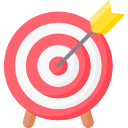
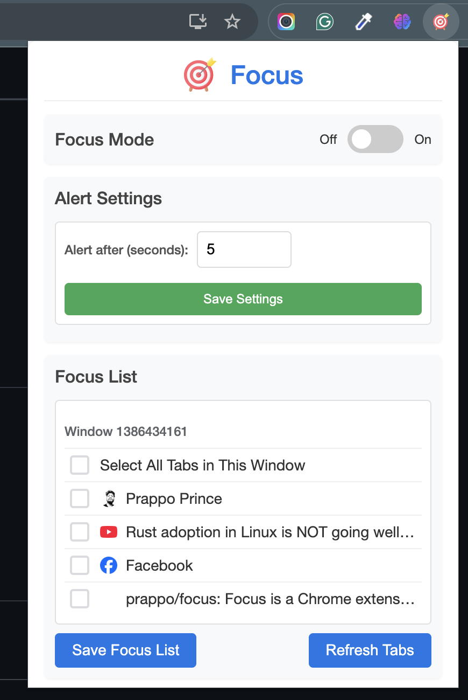
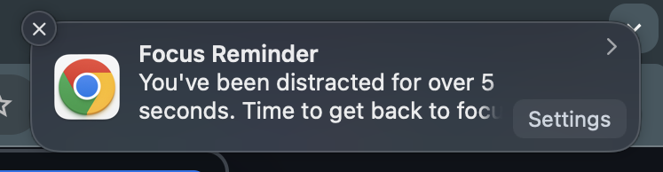

  
  <h1 align="center">Focus</h1>

Focus is a Chrome extension that helps you stay on task by monitoring your browsing habits and gently reminding you when you're getting distracted.

## Screenshots

<!-- table of screenshots -->

| Extension | Notification |
|---|---|
|  |  |

## Features

- **Focus Mode**: When enabled, monitors your browsing and alerts you when you spend too much time on non-focus tabs
- **Customizable Alert Timer**: Set how long you can browse distracting sites before receiving a reminder
- **Time Tracking**: Automatically records time spent on productive sites in your focus list
- **Statistics Dashboard**: View detailed statistics about your productive browsing time
- **Multiple Window Support**: Works across all your Chrome windows
- **Real-time Tab Detection**: Immediately recognizes when you switch between tabs
- **Smart Domain Recognition**: Remembers sites in your focus list even if you close and reopen them

## Installation

### Manual Installation (Developer Mode)
1. Download or clone this repository
2. Open Chrome and navigate to `chrome://extensions`
3. Enable "Developer mode" using the toggle in the top-right corner
4. Click "Load unpacked" and select the extension folder
5. The Focus extension should now appear in your toolbar

## How to Use

### Setting Up Focus List
1. Click the Focus extension icon in your toolbar
2. Under "Focus List", check the tabs you want to include as productive tabs
3. Click "Save Focus List" to store your selections

### Enabling Focus Mode
1. Toggle the "Focus Mode" switch to ON
2. You'll now be monitored while browsing
3. When you spend too much time on non-focus tabs, you'll receive a notification

### Customizing Alert Time
1. In the "Alert Settings" section, enter the number of seconds you want to allow for distraction
2. Click "Save Settings" to apply your changes
3. Default is 30 seconds

### Viewing Your Statistics
1. Your productive time is automatically tracked
2. The "Focus Time Stats" section shows time spent on each productive site
3. You can see total time and when you last visited each site

## How It Works

1. **Focus List Creation**: You select which tabs are productive (focus tabs)
2. **Monitoring**: When Focus Mode is enabled, the extension tracks which tabs you're using
3. **Alerts**: If you spend more than your set time on non-focus tabs, you receive a notification
4. **Time Tracking**: Time spent on focus tabs is recorded for your statistics
5. **Smart Detection**: The extension recognizes domains, not just specific URLs, so all pages on your focus sites are tracked

## Technical Information

- Built with vanilla JavaScript, HTML, and CSS
- Uses Chrome Extension Manifest V3
- Leverages the following Chrome APIs:
  - tabs
  - storage
  - notifications
  - alarms
  - windows

## Privacy

Focus respects your privacy:
- All data is stored locally on your device
- No browsing data is sent to external servers
- No analytics or tracking is implemented

## License

This project is released under the MIT License.
